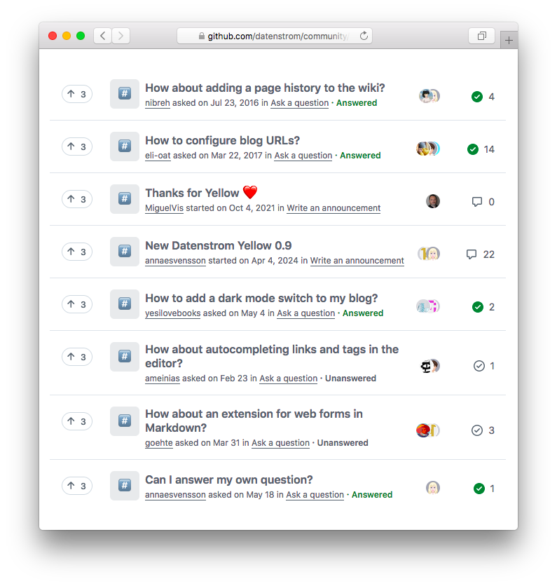

<a href="README-de.md">Deutsch</a> &nbsp; <a href="README.md">English</a> &nbsp; <a href="README-sv.md">Svenska</a>

# Datenstrom-Netzgemeinschaft

Stelle Fragen, melde Fehler und arbeite mit uns.

## Wie man eine Frage stellt

Schreibe die Frage in den Titel, es ist das Erste was alle sehen. Die Datenstrom-Netzgemeinschaft ist ein Ort um sich gegenseitig zu helfen. Wo man Fragen stellen und beantworten kann. Die meisten Antworten werden von Mitgliedern, so wie du, bereitgestellt. Verwende einen Online-Übersetzer, falls Englisch nicht deine Muttersprache ist. [Neue Diskussion beginnen](https://github.com/datenstrom/community/discussions/categories/ask-a-question).

## Wie man einen Fehler meldet

Erkläre wie man den Fehler reproduziert, mit so vielen Informationen wie du hast. Aktiviere den Debug-Modus um die Ursache eines Problems zu untersuchen. Füge die Logdatei dem Fehlerbericht hinzu, sie gibt einen Überblick darüber was auf deiner Website passiert. Wähle eine Antwort aus, wenn der Fehler behoben wurde. [Neue Diskussion beginnen](https://github.com/datenstrom/community/discussions/categories/report-a-bug).

## Wie man mit uns arbeitet

Wir konzentrieren uns auf Menschen. Nicht auf technische Details und viele Funktionen. Es gibt viele Möglichkeiten in unserer Netzgemeinschaft aktiv zu werden. Denke darüber nach was du machen möchtest und was das Leben einfacher machen würde. Erst funktionieren lassen und dann besser machen. [Siehe Tipps zum Zusammenarbeiten](https://github.com/datenstrom/community/discussions/760) und [unbeantwortete Diskussionen](https://github.com/datenstrom/community/discussions?discussions_q=is%3Aunanswered+sort%3Adate_created).

## Danksagung

Hergestellt in Europa. Danke an alle Benutzer, Entwickler, Designer und Übersetzer.
