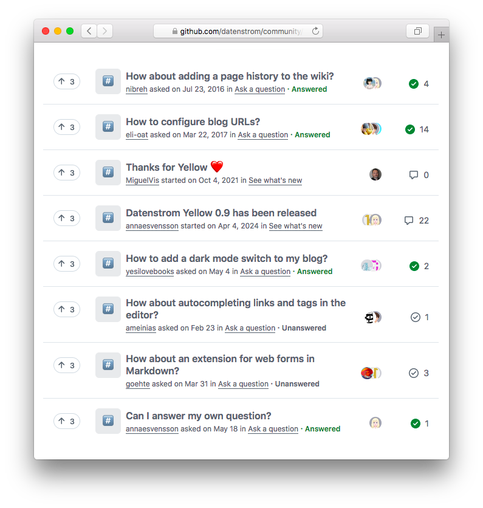

<a href="README-de.md">Deutsch</a> &nbsp; <a href="README.md">English</a> &nbsp; <a href="README-sv.md">Svenska</a>

# Datenstrom nätgemenskap

Ställ frågor, rapportera fel och jobba med oss. [Visa alla diskussioner](https://github.com/datenstrom/community/discussions).

## Hur man ställer en fråga

Skriv frågan i rubriken, det är det första alla kommer att se. Datenstroms nätgemenskapen är en plats att hjälpa varandra. Där du kan ställa och svara på frågor. De flesta av svaren tillhandahålls av medlemmar, precis som du. Använd en översättare om engelska inte är ditt modersmål. Beskriv problemet du försöker lösa. Förklara vad du har försökt hittills. Välj ett svar när din fråga har besvarats. [Starta en ny diskussion](https://github.com/datenstrom/community/discussions/categories/ask-a-question).

## Hur man rapporterar ett fel

Förklara hur man återskapar felet och ge detaljerad information. Aktivera felsökningsläge för att undersöka orsaken till ett problem. Lägg till loggfilen för att visa vad som händer på din webbplats. Kontrollera om felet uppstår i en helt ny installation. Välj ett svar när felet har åtgärdats. [Starta en ny diskussion](https://github.com/datenstrom/community/discussions/categories/report-a-bug).

## Hur man jobbar med oss

Diskutera senaste produktändringarna och nya tilläggen. Vi fokuserar på människor. Inte på tekniska detaljer och massor av funktioner. Det finns många sätt att bli aktiv i Datenstroms nätgemenskap. Föreställ dig vad användaren vill göra och vad som skulle göra deras liv enklare. [Se tips för samarbete](https://github.com/datenstrom/community/discussions/760).

## Tack

Tillverkad i Europa. Tack till alla utvecklare, formgivare och översättare.
